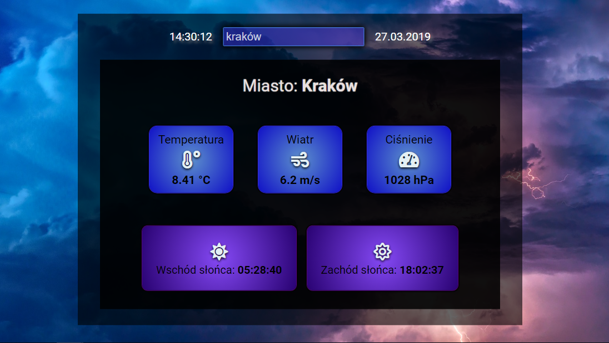

# Weather-app in React

Check weather in your city

## General info

Application using the API (fetch) and the create-react-app for checking the weather.
Data downloaded from https://openweathermap.org/

## Screenshot

## Technologies

- HTMl
- CSS
- React - version 16.8.4 (create-react-app)

## Setup

[Link to demo version](https://pawelniziolek.github.io/Weather-app/)

### Clone the project:

git clone https://github.com/pawelNiziolek/Weather-app

### Instal dependecies:

npm install

### Create api_keys.js file

Go to http://openweathermap.org and create an api_key and copy&paste it to this file like that:
export const OPENWEATHERMAP_API_KEY = 'key';

###Start project:
npm start

###Build project:
npm run build

## Status

Project is: _finished_

## Contact

Created by Paweł Niziołek e-mail: pawel.r.niziolek@gmail.com - contact me!
